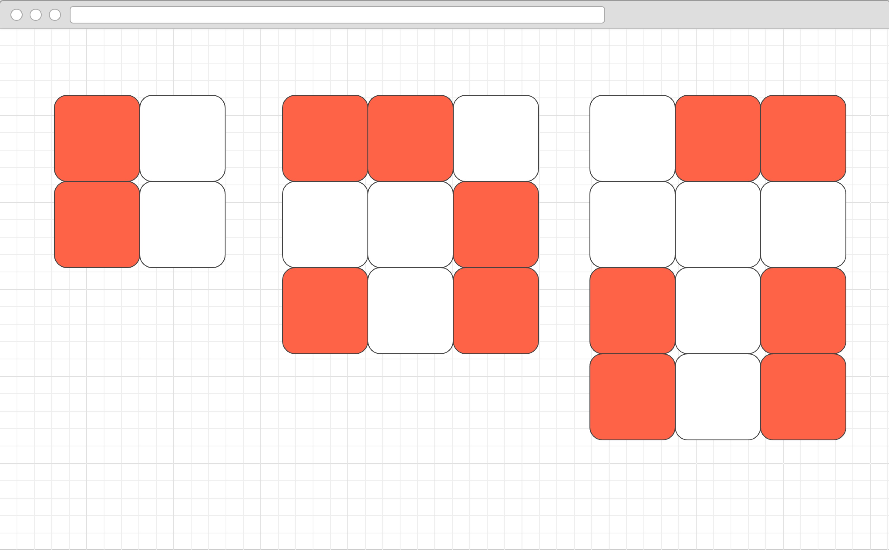
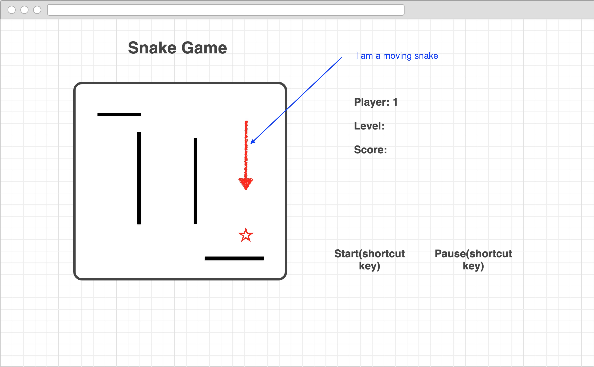

# Color Memory Game

### User Stories

**startGame()**  
**addEventToSquare()**  
**selectRandomColorSquare()**  
**hideSelected()**  
**checkSquare()**  
**nextLevel()**  

* As a user, I need to be able to click a button to start Game
* The game start 2 seconds after clicking
* A matrix with random colored elements appears and stay for 5 seconds
* Colored elements change back to white
* As a user, I need to click on the correct colored box.
* As a user, I need to know whether I click on a correct box.
* As a user, after I click all the colored box, another bigger matrix with random colored elements appears.
* As a user, I need to know the current level.
* As a user, I need to know the other user's score(level).
* When one user hit a wrong box, switch user and start from the easiest level

* Add time count

<!--
# Snake Game

### User Stories

* As a user, I need to be able to click a button to start Game
* As a user, I need the game to start 3 seconds after I click Start button.
* The snake start moving towards a random direction from the edge of the game window when game starts, it has a default length of 5.
* As a user, I need to be able to pause the game.
* The snake's moving direction can be changed by pressing arrow keys(up,left,down,right)
* Add one point to score when the snake eats an item. And add one unit length to the snake.
* Stop game and show message on the screen when the snake hits a barrier. Life minus one.
* Show die message for current player when life equals to 0 and change current player to another player.
* As a user, I need to know which player I am, how many items I eat and how many lives left. Also, what is the score of other player.
* As a user, I need the game to have different levels(5 levels?) (different patterns of barrier/different speed)
* As a user, I need to see where the barrier are. -->
